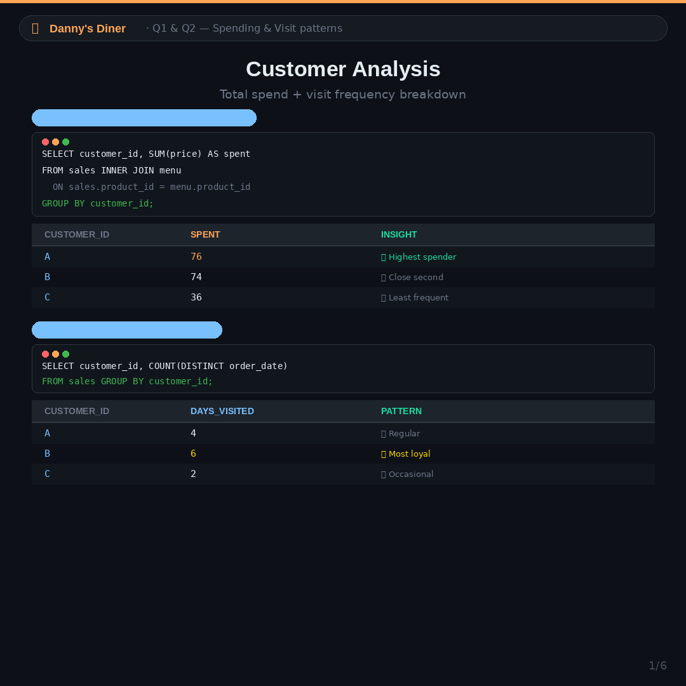
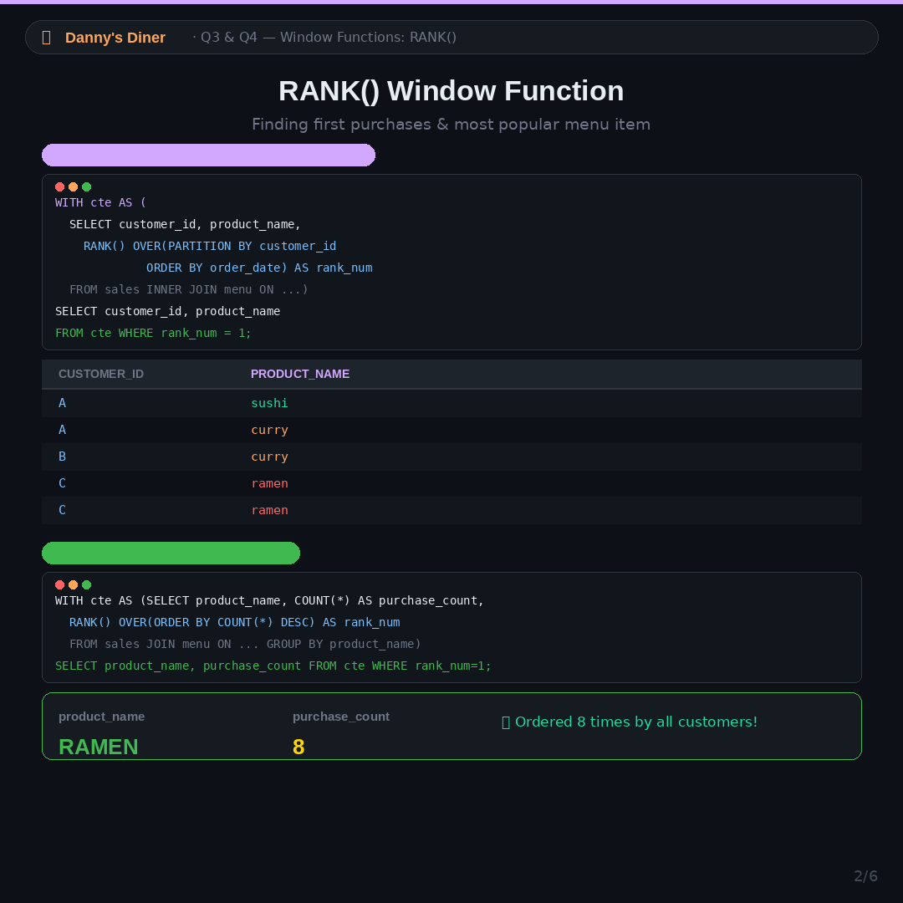
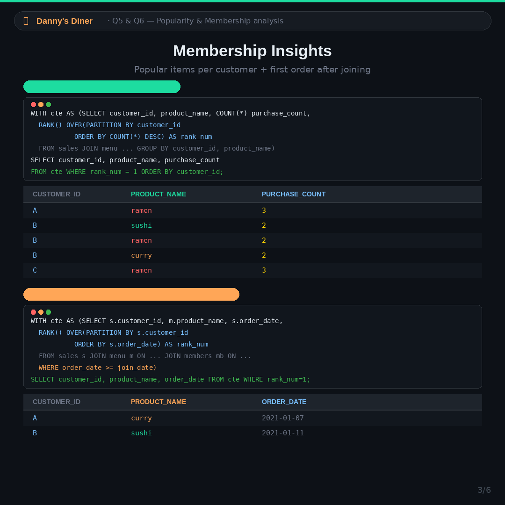
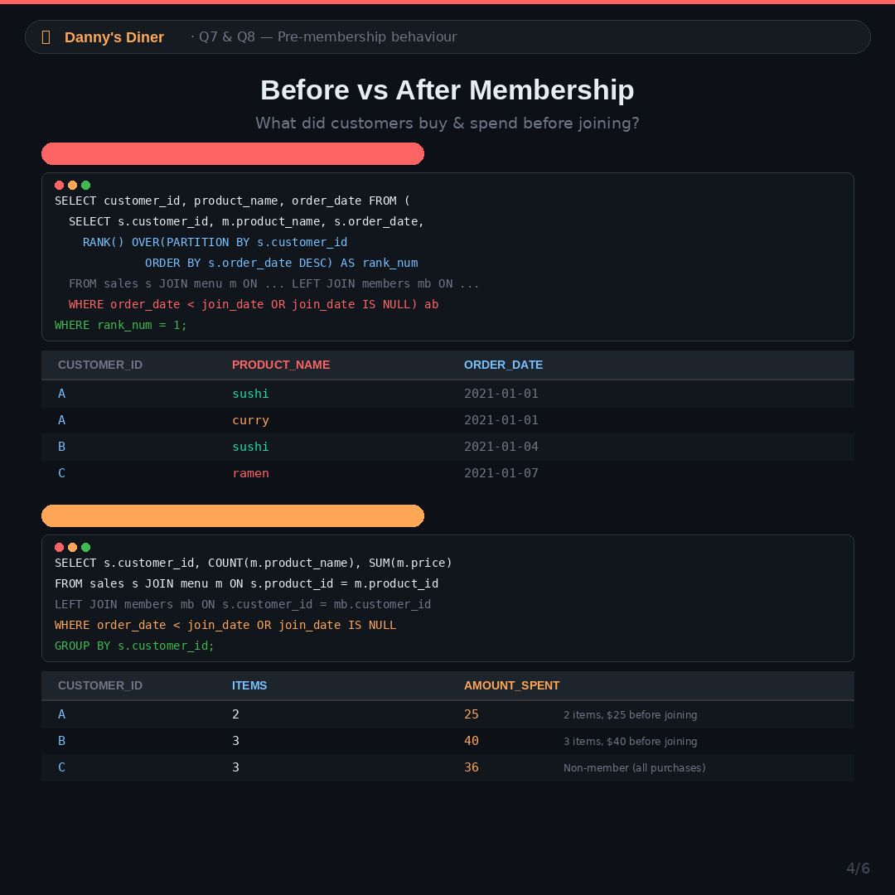
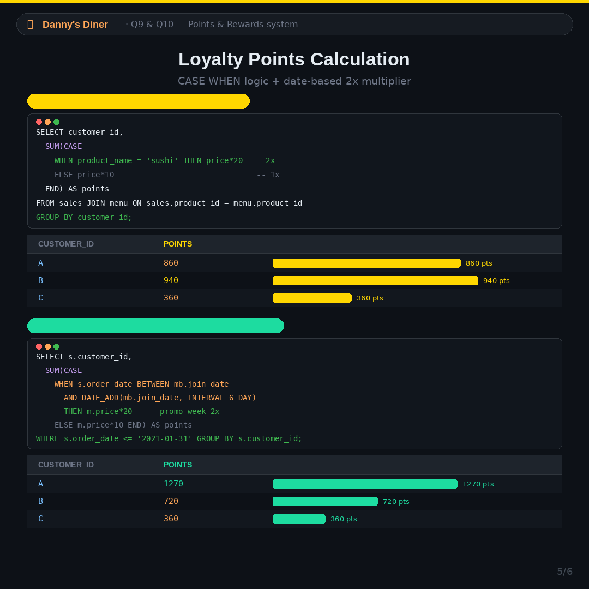
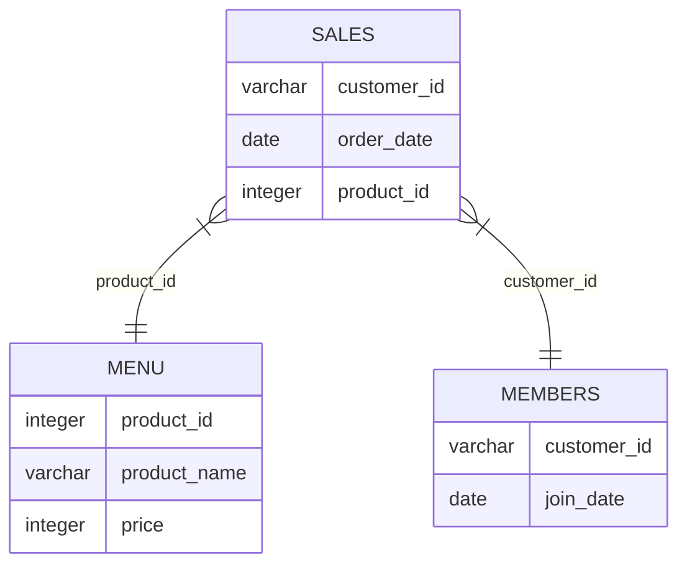

# 🍜 Case Study #1 - Danny's Diner 

This repository contains my SQL solutions for the first case study of **Danny Ma's 8-Week SQL Challenge**. 

I analyzed a restaurant's sales data to find customer behavior patterns, spending habits, and loyalty program impacts.

---

## 📈 Key Insights & Business Takeaways

* **Two Kinds of Loyalty:** 
  * **Customer B** visited the diner 6 days (the most visits/loyalty in frequency).
  * **Customer A** spent the most money ($76 vs $74).
  * *Insight:* One visits often, one spends big. SQL helps us isolate these different customer segments which a simple spreadsheet might miss.
* **Crowd Favorite:** **Ramen** is the most purchased item on the menu (ordered 8 times 🍜).
* **Loyalty Program Impact:** 
  * The loyalty program works — members order significantly more after joining.
  * The first-week 2x bonus points multiplier boosted Customer A's points total by **48%**.
  * **Sushi** underperforms despite its permanent 2x points multiplier — suggesting it needs targeted promotional campaigns.

---

## 📸 Solution Gallery / Carousel
Here are the screenshots of the queries executed and their results. You can find them in the `/images` folder:

| Query 1 & 2 | Query 3 & 4 |
| :---: | :---: |
|  |  |

| Query 5 & 6 | Query 7 & 8 |
| :---: | :---: |
|  |  |

| Query 9 & 10 |
| :---: |
|  |

---

## 📚 Table of Contents
- [Business Task](#-business-task)
- [Entity Relationship Diagram](#-entity-relationship-diagram)
- [Database Schema](#-database-schema)
- [SQL Solutions](#-sql-solutions)

---

## 🎯 Business Task
Danny wants to use the data to answer questions about his customers' visiting patterns, spending habits, and favorite menu items. This enables him to deliver a more personalized experience and decide whether to expand the loyalty program.

---

## 🗺️ ER Diagram



---

## 📂 SQL Solutions

### 1. What is the total amount each customer spent at the restaurant?
```sql
SELECT customer_id, SUM(price) AS spent 
FROM sales 
INNER JOIN menu ON sales.product_id = menu.product_id 
GROUP BY customer_id;
```

### 2. How many days has each customer visited the restaurant?
```sql
SELECT customer_id, COUNT(DISTINCT(order_date)) AS visits
FROM sales 
GROUP BY customer_id;
```

### 3. What was the first item from the menu purchased by each customer?
```sql
WITH cte AS (
    SELECT 
        customer_id, 
        product_name, 
        RANK() OVER(PARTITION BY customer_id ORDER BY order_date) AS rank_num
    FROM sales 
    INNER JOIN menu ON sales.product_id = menu.product_id 
)
SELECT customer_id, product_name 
FROM cte 
WHERE rank_num = 1;
```

### 4. What is the most purchased item on the menu and how many times was it purchased by all customers?
```sql
WITH cte AS (
    SELECT 
        product_name, 
        COUNT(*) AS purchase_count, 
        RANK() OVER(ORDER BY COUNT(*) DESC) AS rank_num
    FROM sales 
    INNER JOIN menu ON sales.product_id = menu.product_id 
    GROUP BY product_name
)
SELECT product_name, purchase_count 
FROM cte 
WHERE rank_num = 1;
```

### 5. Which item was the most popular for each customer?
```sql
WITH cte AS (
    SELECT 
        customer_id, 
        product_name, 
        COUNT(*) AS purchase_count,
        RANK() OVER(PARTITION BY customer_id ORDER BY COUNT(*) DESC) AS rank_num
    FROM sales 
    INNER JOIN menu ON sales.product_id = menu.product_id 
    GROUP BY customer_id, product_name 
)
SELECT customer_id, product_name, purchase_count 
FROM cte
WHERE rank_num = 1
ORDER BY customer_id;
```

### 6. Which item was purchased first by the customer after they became a member?
```sql
WITH cte AS (
    SELECT 
        s.customer_id, 
        m.product_name, 
        s.order_date, 
        RANK() OVER(PARTITION BY s.customer_id ORDER BY s.order_date) AS rank_num
    FROM sales s 
    INNER JOIN menu m ON s.product_id = m.product_id 
    INNER JOIN members mb ON s.customer_id = mb.customer_id
    WHERE s.order_date >= mb.join_date
)
SELECT customer_id, product_name, order_date 
FROM cte 
WHERE rank_num = 1;
```

### 7. Which item was purchased just before the customer became a member?
```sql
SELECT customer_id, product_name, order_date 
FROM (
    SELECT 
        s.customer_id, 
        m.product_name, 
        s.order_date,
        RANK() OVER(PARTITION BY s.customer_id ORDER BY s.order_date DESC) AS rank_num
    FROM sales s 
    INNER JOIN menu m ON s.product_id = m.product_id 
    LEFT JOIN members mb ON s.customer_id = mb.customer_id
    WHERE s.order_date < mb.join_date OR mb.join_date IS NULL
) AS sub
WHERE rank_num = 1;
```

### 8. What is the total items and amount spent for each member before they became a member?
```sql
SELECT 
    s.customer_id, 
    COUNT(m.product_name) AS total_items, 
    SUM(m.price) AS amount_spent
FROM sales s 
INNER JOIN menu m ON s.product_id = m.product_id 
LEFT JOIN members mb ON s.customer_id = mb.customer_id
WHERE s.order_date < mb.join_date OR mb.join_date IS NULL
GROUP BY s.customer_id;
```

### 9. If each $1 spent equates to 10 points and sushi has a 2x points multiplier - how many points would each customer have?
```sql
SELECT 
    customer_id, 
    SUM(CASE WHEN product_name = 'sushi' THEN price * 20 ELSE price * 10 END) AS points 
FROM sales 
INNER JOIN menu ON sales.product_id = menu.product_id 
GROUP BY customer_id;
```

### 10. In the first week after a customer joins the program (including their join date) they earn 2x points on all items, not just sushi - how many points do customer A and B have at the end of January?
```sql
SELECT 
    s.customer_id, 
    SUM(CASE 
        WHEN s.order_date BETWEEN mb.join_date AND DATE_ADD(mb.join_date, INTERVAL 6 DAY) THEN m.price * 20
        ELSE m.price * 10
    END) AS points
FROM sales s 
INNER JOIN menu m ON s.product_id = m.product_id 
LEFT JOIN members mb ON s.customer_id = mb.customer_id
WHERE s.order_date <= '2021-01-31'
GROUP BY customer_id;
```
