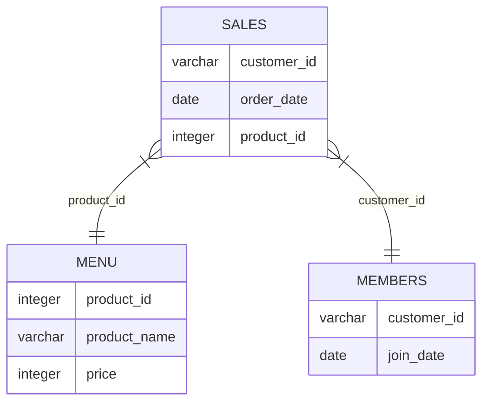

# 🍜 Case Study #1 - Danny's Diner 

This repository contains the solution for the first case study of **Danny Ma's 8-Week SQL Challenge**. 

Detailed case study information can be found on the [official website](https://8weeksqlchallenge.com/case-study-1/).

---

## 📚 Table of Contents
- [Business Task](#-business-task)
- [Entity Relationship Diagram](#-entity-relationship-diagram)
- [Database Schema](#-database-schema)
- [Solutions](#-solutions)
- [Key Insights & Recommendations](#-key-insights--recommendations)

---

## 🎯 Business Task
Danny wants to use the data to answer a few simple questions about his customers, especially about their visiting patterns, how much money they’ve spent, and which menu items are their favorite. 

Having this deeper connection with his customers will help him deliver a better and more personalized experience for his loyal customers. He plans on using these insights to help him decide whether he should expand the existing customer loyalty program.

---

## 🗺️ Entity Relationship Diagram



---

## 📂 Solutions

### 1. What is the total amount each customer spent at the restaurant?
```sql
SELECT customer_id, SUM(price) AS spent 
FROM sales 
INNER JOIN menu ON sales.product_id = menu.product_id 
GROUP BY customer_id;
```
| customer_id | spent |
|-------------|-------|
| A           | 76    |
| B           | 74    |
| C           | 36    |

---

### 2. How many days has each customer visited the restaurant?
```sql
SELECT customer_id, COUNT(DISTINCT(order_date)) AS visits
FROM sales 
GROUP BY customer_id;
```
| customer_id | visits |
|-------------|--------|
| A           | 4      |
| B           | 6      |
| C           | 2      |

---

### 3. What was the first item from the menu purchased by each customer?
```sql
WITH cte AS (
    SELECT 
        customer_id, 
        product_name, 
        RANK() OVER(PARTITION BY customer_id ORDER BY order_date) AS rank_num
    FROM sales 
    INNER JOIN menu ON sales.product_id = menu.product_id 
)
SELECT customer_id, product_name 
FROM cte 
WHERE rank_num = 1;
```
| customer_id | product_name |
|-------------|--------------|
| A           | sushi        |
| A           | curry        |
| B           | curry        |
| C           | ramen        |

---

### 4. What is the most purchased item on the menu and how many times was it purchased by all customers?
```sql
WITH cte AS (
    SELECT 
        product_name, 
        COUNT(*) AS purchase_count, 
        RANK() OVER(ORDER BY COUNT(*) DESC) AS rank_num
    FROM sales 
    INNER JOIN menu ON sales.product_id = menu.product_id 
    GROUP BY product_name
)
SELECT product_name, purchase_count 
FROM cte 
WHERE rank_num = 1;
```
| product_name | purchase_count |
|-------------|----------------|
| ramen       | 8              |

---

### 5. Which item was the most popular for each customer?
```sql
WITH cte AS (
    SELECT 
        customer_id, 
        product_name, 
        COUNT(*) AS purchase_count,
        RANK() OVER(PARTITION BY customer_id ORDER BY COUNT(*) DESC) AS rank_num
    FROM sales 
    INNER JOIN menu ON sales.product_id = menu.product_id 
    GROUP BY customer_id, product_name 
)
SELECT customer_id, product_name, purchase_count 
FROM cte
WHERE rank_num = 1
ORDER BY customer_id;
```
| customer_id | product_name | purchase_count |
|-------------|--------------|----------------|
| A           | ramen        | 3              |
| B           | curry        | 2              |
| B           | sushi        | 2              |
| B           | ramen        | 2              |
| C           | ramen        | 2              |

---

### 6. Which item was purchased first by the customer after they became a member?
```sql
WITH cte AS (
    SELECT 
        s.customer_id, 
        m.product_name, 
        s.order_date, 
        RANK() OVER(PARTITION BY s.customer_id ORDER BY s.order_date) AS rank_num
    FROM sales s 
    INNER JOIN menu m ON s.product_id = m.product_id 
    INNER JOIN members mb ON s.customer_id = mb.customer_id
    WHERE s.order_date >= mb.join_date
)
SELECT customer_id, product_name, order_date 
FROM cte 
WHERE rank_num = 1;
```
| customer_id | product_name | order_date |
|-------------|--------------|------------|
| A           | curry        | 2021-01-07 |
| B           | sushi        | 2021-01-11 |

---

### 7. Which item was purchased just before the customer became a member?
```sql
SELECT customer_id, product_name, order_date 
FROM (
    SELECT 
        s.customer_id, 
        m.product_name, 
        s.order_date,
        RANK() OVER(PARTITION BY s.customer_id ORDER BY s.order_date DESC) AS rank_num
    FROM sales s 
    INNER JOIN menu m ON s.product_id = m.product_id 
    LEFT JOIN members mb ON s.customer_id = mb.customer_id
    WHERE s.order_date < mb.join_date OR mb.join_date IS NULL
) AS sub
WHERE rank_num = 1;
```
| customer_id | product_name | order_date |
|-------------|--------------|------------|
| A           | sushi        | 2021-01-01 |
| A           | curry        | 2021-01-01 |
| B           | sushi        | 2021-01-11 |

---

### 8. What is the total items and amount spent for each member before they became a member?
```sql
SELECT 
    s.customer_id, 
    COUNT(m.product_name) AS total_items, 
    SUM(m.price) AS amount_spent
FROM sales s 
INNER JOIN menu m ON s.product_id = m.product_id 
LEFT JOIN members mb ON s.customer_id = mb.customer_id
WHERE s.order_date < mb.join_date OR mb.join_date IS NULL
GROUP BY s.customer_id;
```
| customer_id | total_items | amount_spent |
|-------------|-------------|--------------|
| A           | 2           | 25           |
| B           | 3           | 40           |

---

### 9. If each $1 spent equates to 10 points and sushi has a 2x points multiplier - how many points would each customer have?
```sql
SELECT 
    customer_id, 
    SUM(CASE WHEN product_name = 'sushi' THEN price * 20 ELSE price * 10 END) AS points 
FROM sales 
INNER JOIN menu ON sales.product_id = menu.product_id 
GROUP BY customer_id;
```
| customer_id | points |
|-------------|--------|
| A           | 860    |
| B           | 940    |
| C           | 360    |

---

### 10. In the first week after a customer joins the program (including their join date) they earn 2x points on all items, not just sushi - how many points do customer A and B have at the end of January?
```sql
SELECT 
    s.customer_id, 
    SUM(CASE 
        WHEN s.order_date BETWEEN mb.join_date AND DATE_ADD(mb.join_date, INTERVAL 6 DAY) THEN m.price * 20
        ELSE m.price * 10
    END) AS points
FROM sales s 
INNER JOIN menu m ON s.product_id = m.product_id 
LEFT JOIN members mb ON s.customer_id = mb.customer_id
WHERE s.order_date <= '2021-01-31'
GROUP BY customer_id;
```
| customer_id | points |
|-------------|--------|
| A           | 1370   |
| B           | 820    |

---

## 📈 Key Insights & Recommendations
* **Ramen** is the undisputed crowd favorite, with 8 total orders. It should remain the core focus of menu advertising.
* **Customer A** is the highest spender ($76), closely followed by **Customer B** ($74).
* The **first week membership bonus** works well; customer A accumulated 1,370 points rapidly within January due to first-week visits.
